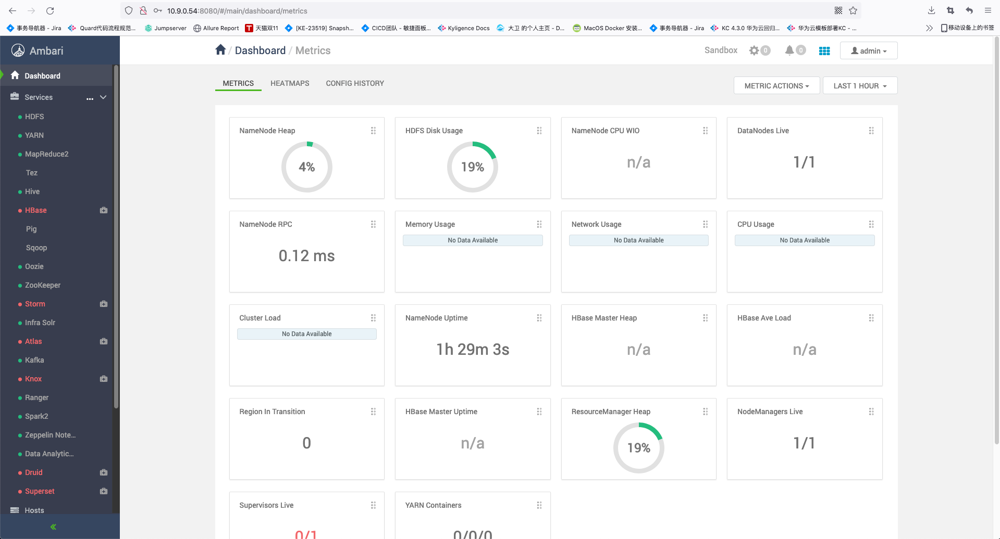

### 安装 HDP-3.0.1

> 配置  
> 操作系统: Ubuntu-18.04(bionic)  
> CPU: Intel(R) Core(TM) i7-8550U CPU @ 1.80GHz <4 cores 8 threads>  
> Memory: 16 GB

1. 安装 docker, [参考链接](https://docs.docker.com/engine/install/ubuntu/)
```shell
$ sudo service ufw stop
$ sudo ufw disable
$ sudo apt-get remove iptables

$ sudo apt-get update
$ sudo apt-get install \
               ca-certificates \
               curl \
               gnupg \
               lsb-release

$ sudo curl -fsSL https://download.docker.com/linux/ubuntu/gpg | sudo gpg --dearmor -o /usr/share/keyrings/docker-archive-keyring.gpg


$ echo "deb [arch=$(dpkg --print-architecture) \
       signed-by=/usr/share/keyrings/docker-archive-keyring.gpg] \ 
       https://download.docker.com/linux/ubuntu \
       $(lsb_release -cs) stable" | \
       sudo tee /etc/apt/sources.list.d/docker.list > /dev/null

$ sudo apt-get update
$ sudo apt-get install docker-ce docker-ce-cli containerd.io

```

2. 安装 hdp-3.0.1, [参考链接](https://www.cloudera.com/tutorials/sandbox-deployment-and-install-guide/3.html)
```shell
$ mkdir ~/Documents/hdp-3.0.1/
$ cd ~/Documents/hdp-3.0.1/
$ wget https://archive.cloudera.com/hwx-sandbox/hdp/hdp-3.0.1/HDP_3.0.1_docker-deploy-scripts_18120587fc7fb.zip
$ unzip HDP_3.0.1_docker-deploy-scripts_18120587fc7fb.zip
$ sudo bash docker-deploy-hdp30.sh
```

3. 登录 Ambari  
默认的用户名: admin  
默认的密码: admin  
但是在我的环境下这个默认的用户名和密码无效, 所以我需要重置一下用户名和密码, [参考链接](https://community.cloudera.com/t5/Support-Questions/HDP-Ambari-default-login-not-working/td-p/219565).   
```shell
$ sudo docker ps -a
CONTAINER ID   NAMES             PORTS
d0df1aa6235c   sandbox-hdp       22/tcp, 4200/tcp, 8080/tcp
59380c540268   sandbox-proxy     80/tcp, 
                                 0.0.0.0:1080->1080/tcp, :::1080->1080/tcp,
                                 0.0.0.0:1100->1100/tcp, :::1100->1100/tcp, 
                                 0.0.0.0:1111->1111/tcp, :::1111->1111/tcp, 
                                 0.0.0.0:1988->1988/tcp, :::1988->1988/tcp, 
                                 0.0.0.0:2100->2100/tcp, :::2100->2100/tcp, 
                                 0.0.0.0:2181-2182->2181-2182/tcp, :::2181-2182->2181-2182/tcp, 
                                 0.0.0.0:2201-2202->2201-2202/tcp, :::2201-2202->2201-2202/tcp, 
                                 0.0.0.0:2222->2222/tcp, :::2222->2222/tcp, 
                                 0.0.0.0:3000->3000/tcp, :::3000->3000/tcp, 
                                 0.0.0.0:4040->4040/tcp, :::4040->4040/tcp, 
                                 0.0.0.0:4200->4200/tcp, :::4200->4200/tcp, 
                                 0.0.0.0:4242->4242/tcp, :::4242->4242/tcp, 
                                 0.0.0.0:4557->4557/tcp, :::4557->4557/tcp, 
                                 0.0.0.0:5007->5007/tcp, :::5007->5007/tcp, 
                                 0.0.0.0:5011->5011/tcp, :::5011->5011/tcp, 
                                 0.0.0.0:6001->6001/tcp, :::6001->6001/tcp, 
                                 0.0.0.0:6003->6003/tcp, :::6003->6003/tcp, 
                                 0.0.0.0:6008->6008/tcp, :::6008->6008/tcp, 
                                 0.0.0.0:6080->6080/tcp, :::6080->6080/tcp, 
                                 0.0.0.0:6188->6188/tcp, :::6188->6188/tcp, 
                                 0.0.0.0:6627->6627/tcp, :::6627->6627/tcp, 
                                 0.0.0.0:6667-6668->6667-6668/tcp, :::6667-6668->6667-6668/tcp, 
                                 0.0.0.0:7777->7777/tcp, :::7777->7777/tcp, 
                                 0.0.0.0:7788->7788/tcp, :::7788->7788/tcp, 
                                 0.0.0.0:8000->8000/tcp, :::8000->8000/tcp, 
                                 0.0.0.0:8005->8005/tcp, :::8005->8005/tcp, 
                                 0.0.0.0:8020->8020/tcp, :::8020->8020/tcp, 
                                 0.0.0.0:8032->8032/tcp, :::8032->8032/tcp, 
                                 0.0.0.0:8040->8040/tcp, :::8040->8040/tcp, 
                                 0.0.0.0:8042->8042/tcp, :::8042->8042/tcp, 
                                 0.0.0.0:8080-8082->8080-8082/tcp, :::8080-8082->8080-8082/tcp, 
                                 0.0.0.0:8086->8086/tcp, :::8086->8086/tcp, 
                                 0.0.0.0:8088->8088/tcp, :::8088->8088/tcp, 
                                 0.0.0.0:8090-8091->8090-8091/tcp, :::8090-8091->8090-8091/tcp, 
                                 0.0.0.0:8188->8188/tcp, :::8188->8188/tcp, 
                                 0.0.0.0:8198->8198/tcp, :::8198->8198/tcp, 
                                 0.0.0.0:8443->8443/tcp, :::8443->8443/tcp, 
                                 0.0.0.0:8585->8585/tcp, :::8585->8585/tcp, 
                                 0.0.0.0:8744->8744/tcp, :::8744->8744/tcp, 
                                 0.0.0.0:8765->8765/tcp, :::8765->8765/tcp, 
                                 0.0.0.0:8886->8886/tcp, :::8886->8886/tcp, 
                                 0.0.0.0:8888-8889->8888-8889/tcp, :::8888-8889->8888-8889/tcp, 
                                 0.0.0.0:8983->8983/tcp, :::8983->8983/tcp, 
                                 0.0.0.0:8993->8993/tcp, :::8993->8993/tcp, 
                                 0.0.0.0:9000->9000/tcp, :::9000->9000/tcp, 
                                 0.0.0.0:9088-9091->9088-9091/tcp, :::9088-9091->9088-9091/tcp, 
                                 0.0.0.0:9995-9996->9995-9996/tcp, :::9995-9996->9995-9996/tcp, 
                                 0.0.0.0:10000-10002->10000-10002/tcp, :::10000-10002->10000-10002/tcp, 
                                 0.0.0.0:10015-10016->10015-10016/tcp, :::10015-10016->10015-10016/tcp, 
                                 0.0.0.0:10500->10500/tcp, :::10500->10500/tcp, 
                                 0.0.0.0:10502->10502/tcp, :::10502->10502/tcp, 
                                 0.0.0.0:11000->11000/tcp, :::11000->11000/tcp, 
                                 0.0.0.0:12049->12049/tcp, :::12049->12049/tcp, 
                                 0.0.0.0:12200->12200/tcp, :::12200->12200/tcp, 
                                 0.0.0.0:15000->15000/tcp, :::15000->15000/tcp, 
                                 0.0.0.0:15002->15002/tcp, :::15002->15002/tcp, 
                                 0.0.0.0:15500->15500/tcp, :::15500->15500/tcp, 
                                 0.0.0.0:16000->16000/tcp, :::16000->16000/tcp, 
                                 0.0.0.0:16010->16010/tcp, :::16010->16010/tcp, 
                                 0.0.0.0:16020->16020/tcp, :::16020->16020/tcp, 
                                 0.0.0.0:16030->16030/tcp, :::16030->16030/tcp, 
                                 0.0.0.0:18080-18081->18080-18081/tcp, :::18080-18081->18080-18081/tcp, 
                                 0.0.0.0:19888->19888/tcp, :::19888->19888/tcp, 
                                 0.0.0.0:21000->21000/tcp, :::21000->21000/tcp, 
                                 0.0.0.0:30800->30800/tcp, :::30800->30800/tcp, 
                                 0.0.0.0:33553->33553/tcp, :::33553->33553/tcp, 
                                 0.0.0.0:39419->39419/tcp, :::39419->39419/tcp, 
                                 0.0.0.0:42111->42111/tcp, :::42111->42111/tcp, 
                                 0.0.0.0:50070->50070/tcp, :::50070->50070/tcp, 
                                 0.0.0.0:50075->50075/tcp, :::50075->50075/tcp, 
                                 0.0.0.0:50079->50079/tcp, :::50079->50079/tcp, 
                                 0.0.0.0:50095->50095/tcp, :::50095->50095/tcp, 
                                 0.0.0.0:50111->50111/tcp, :::50111->50111/tcp, 
                                 0.0.0.0:60000->60000/tcp, :::60000->60000/tcp, 
                                 0.0.0.0:60080->60080/tcp, :::60080->60080/tcp, 
                                 0.0.0.0:61080->61080/tcp, :::61080->61080/tcp, 
                                 0.0.0.0:61888->61888/tcp, :::61888->61888/tcp
                                 
$ sudo docker exec -it sandbox-hdp /bin/bash

# 进入 docker 容器 sandbox-hdp 内, 执行重置密码操作.
[root@sandbox-hdp /]# ambari-admin-password-reset
Please set the password for admin: 
Please retype the password for admin:

# 然后下面会输出 Ambari 重启服务的信息.
The admin password has been set.
Restarting ambari-server to make the password change effective...

Using python  /usr/bin/python
Restarting ambari-server
Waiting for server stop...
Ambari Server stopped
Ambari Server running with administrator privileges.
Organizing resource files at /var/lib/ambari-server/resources...
Ambari database consistency check started...
Server PID at: /var/run/ambari-server/ambari-server.pid
Server out at: /var/log/ambari-server/ambari-server.out
Server log at: /var/log/ambari-server/ambari-server.log
Waiting for server start..............................................................................................
Server started listening on 8080

DB configs consistency check: no errors and warnings were found.
```
登录后的界面如下
