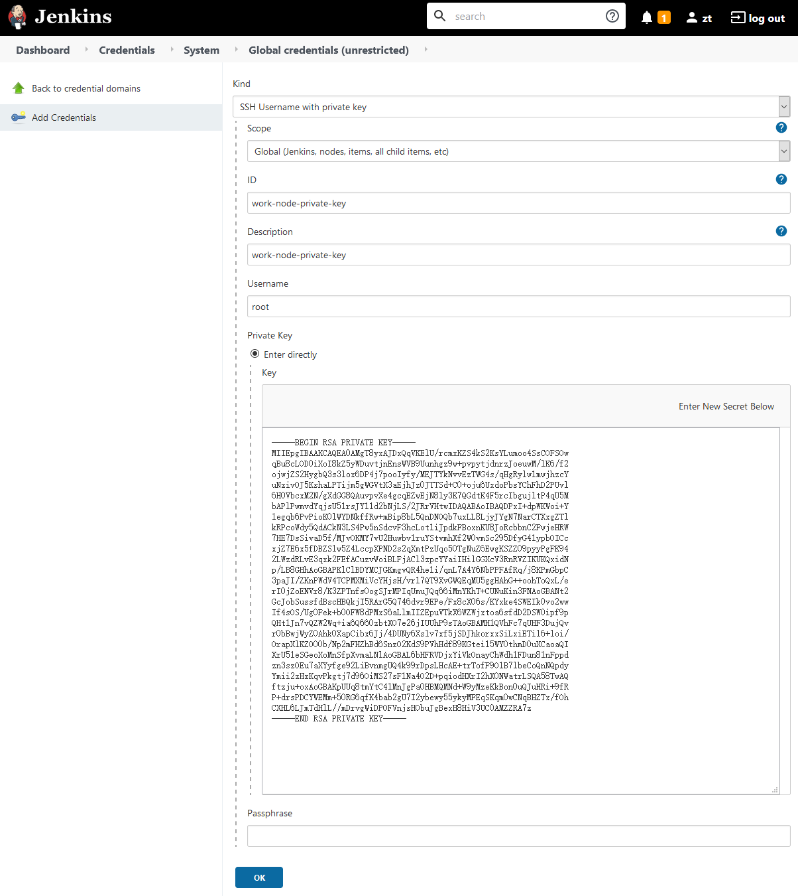
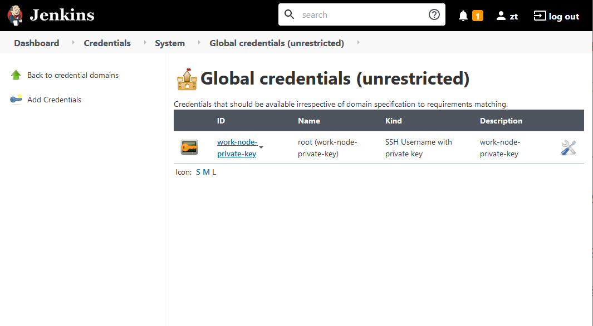

### 添加公共凭证

1. 在 linux 服务器上生成公钥和密钥文件.
   ```shell
   [root@localhost ~]# cd .ssh
   [root@localhost .ssh]# ssh-keygen -t rsa -N '' -f id_rsa
   [root@localhost .ssh]# ls
   id_rsa  id_rsa.pub
   
   # 将公钥追加到 authorized_keys 文件中.
   # 这里可能需要手动编辑处理换行问题.
   [root@localhost .ssh]# cat id_rsa.pub >> authorized_keys
   
   # 下载密钥, 妥善保管
   [root@localhost ssh-key]# mv id_rsa jenkins-work-node-private-key        # 重命名密钥文件
   [root@localhost ssh-key]# sz jenkins-work-node-private-key               # 下载密钥文件, 连接服务器时使用.
   [root@localhost ssh-key]# rm jenkins-work-node-private-key               # 服务器上不需要密钥文件, 所以这里将其删除掉.
   
   # 备注:
   # 在 Jenkins 的视角来看, linux 服务器的角色就是 work-node.
   # 也就是说, 只要将 id_rsa.pub 复制到每台 linux 服务器的 /root/.ssh/authorized_keys 中, 就可以免密码登陆了.   
   ```

2. 将公钥文本(id_rsa.pub)添加到jenkins-credentials中.   
   1). 复制公钥文本(id_rsa.pub).   
   2). 找到添加凭证位置: Manage Jenkins -> Security -> Manage Credentials -> Store scoped to Jenkins -> global   
   3). 进入添加凭证界面: Add credentials(菜单左侧)   
   4). 填写凭证信息.   
          
       
3. 后续   
   完成凭证添加后, Jenkins就具备了免密钥登陆能力.   
      
   
   当未来添加更多 `work-node` 服务器时, 只需要将 `id_rsa.pub` 追加到新增得 `work-node` 的 `/root/.ssh/authorized_key` 中即可.  
   Jenkins无需做任何事情就可以免密码登陆到新的 `work-node` 服务器.  
   