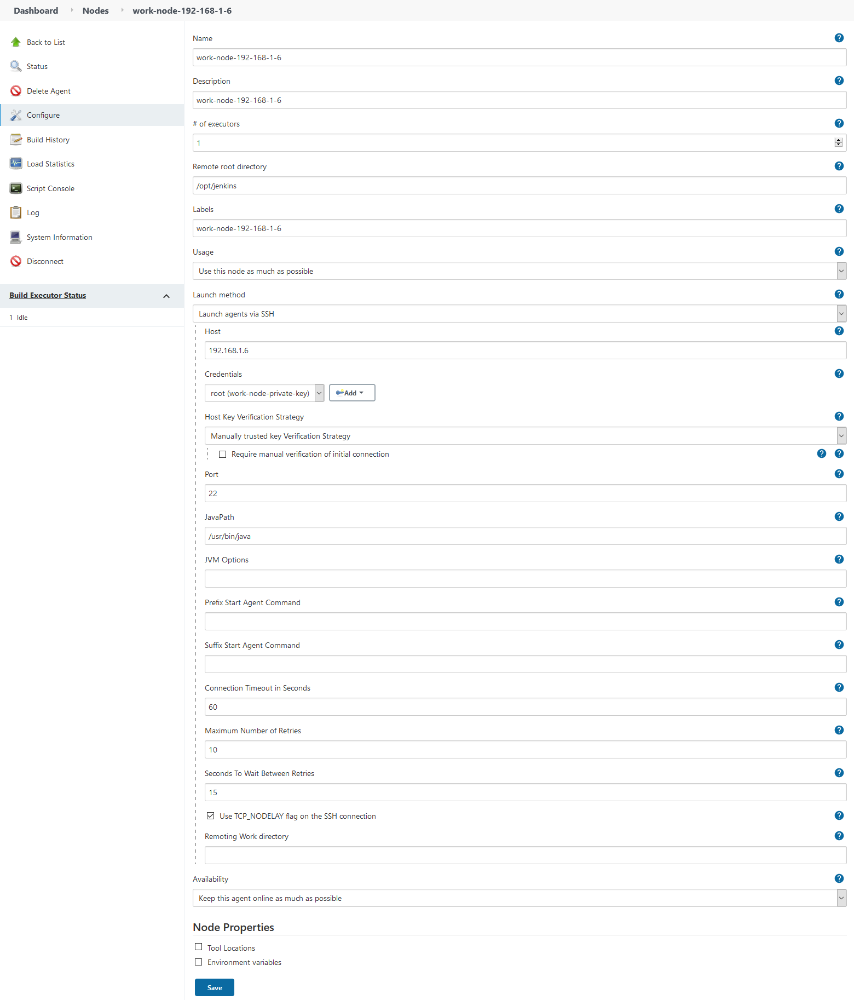
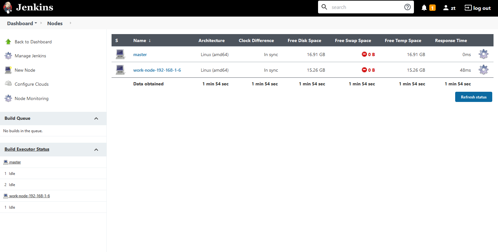

### 添加节点
添加节点可以分担已有节点的构建工作, 即: 将不同的构建任务放在不同的节点上完成.   

1. 准备工作  
   [公钥拷贝参考这里](generate_credential.md)
   ```shell
   # 假设已有工作节点的ip是: 192.168.1.7    
   # 假设新增工作节点的ip是: 192.168.1.6
   # 
   # 可以将 192.168.1.7 的 /root/.ssh/authorized_keys 
   # 拷贝到 192.168.1.6 的 /root/.ssh/authorized_keys
   
   # 在 192.168.1.7 服务器中执行命令
   scp /root/.ssh/authorized_keys root@192.168.1.6:/root/.ssh/
   
   # 进入 192.168.1.6 服务器, 执行命令
   yum install java-11-openjdk-devel -y   
   ```

2. 找到添加节点的位置
   Manage Jenkins -> System Configuration -> Manage Nodes and Clouds -> New Node
   

3. 验证节点添加是否成功  
   1). 查看节点列表, 访问: `https://IP:8080/computer/`
   
   
   2). 查看节点日志信息, 访问: `https://IP:8080/computer/work-node-192-168-1-6/log`   
   
   