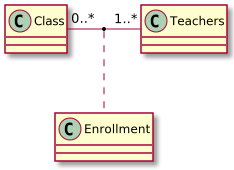
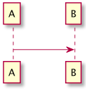

### 参与者(actor)
参与者是在系统之外与系统交互的某人或某事物, page-43, [参考-1](https://plantuml.com/zh/sequence-diagram#5d2ed256d73a7298)  
- [actor.plantuml](plant_umls/actor.plantuml)
  ```plantuml
  @startuml
  'actor 是一个专有单词, 用于表示参与者. 
  actor ZhangSan
  ZhangSan -> System: 访问
  ZhangSan <- System: 返回
  @enduml
  ```
- [actor.png](plant_umls/actor.png)
  <p align="center">
    
  </p>

&nbsp;  
&nbsp;  
### 给自己发消息  
参与者可以给自己发信息, [参考-1](), [参考-2](https://forum.plantuml.net/6180/message-displayed-standard-immediately-before-deactivate).   

- [msg2self.plantuml](plant_umls/msg2self.plantuml)
  ```plantuml
  @startuml
  fibonacci->fibonacci: 递归调用
  @enduml
  ```

- [msg2self.png](plant_umls/msg2self.png)  
  <p align="center">
    
  </p>


- [recursion_complex.py](../algorithms/wz-course/essence/recursion_complex.py#L7)  
  ```python3
  def fibonacci(n: int) -> int:
      if n == 0:
          return 0
      elif n == 1:
          return 1
      else:
          return fibonacci(n - 1) + fibonacci(n -2)
  ```

&nbsp;  
&nbsp;  
### 生命线的激活和撤销  
关键字`activate`和`deactivate`用来表示`参与者`一次完整的生命活动.  
- [activate.plantuml](plant_umls/activate.plantuml)
  ```plantuml
  @startuml
  participant User

  User -> A: DoWork-1(重点)
  activate A

  A -> B: << createRequest >>
  activate B

  B -> C: DoWork-1
  activate C
  C --> B: WorkDone
  destroy C

  B --> A: RequestCreated
  deactivate B

  A -> User: Done
  deactivate A

  User -> A: DoWork-2(重点)
  activate A
  A -> A: call self
  A -> User: Done
  deactivate A

  @enduml
  ```
- [activate.png](plant_umls/activate.png)  
  <p align="center">
    
  </p>


&nbsp;  
&nbsp;  
### 关联关系(Association)  
[参考资料-1](https://plantuml.com/zh/class-diagram) 、
[参考资料-2](https://creately.com/blog/diagrams/class-diagram-relationships/) 、
[参考资料-3](https://forum.plantuml.net/8022/how-to-make-the-horizontal-line-longer)  

|语法|说明|图|代码|
|---|---|---|---|
|-|**一对一** <br />横向连接两个对象||[association_1.plantuml](plant_umls/association_1.plantuml)|
|--|**一对一** <br />纵向向连接两个对象||[association_2.plantuml](plant_umls/association_2.plantuml)|
|Student "1..*" -  Teacher|**一对多** <br />一个老师对应多个学生||[association_3.plantuml](plant_umls/association_3.plantuml)|
|Class "0..*" - "1..*" Teachers <br />(Class, Teachers) .. Enrollment|**多对多** <br />一个班级有多个老师, <br />一个老师也可以带多个班级. ||[association_4.plantuml](plant_umls/association_4.plantuml)|
|A->B|**强调方向** <br />A知道B, 而B不知道A. ||[association_5.plantuml](plant_umls/association_5.plantuml)|


&nbsp;  
&nbsp;  
### 依赖关系(Dependency)  
|语法|说明|图|代码|
|---|---|---|---|
|A .> B|**依赖** <br /> A依赖B(A use B)||[dependency.plantuml](plant_umls/dependency.plantuml)|

&nbsp;  
&nbsp;  
### 实现关系(Realize)
[参考资料-1](https://www.uml-diagrams.org/realization.html)  

|语法|说明|图|代码|
|---|---|---|---|
|interface SiteSearch <br />Class SearchService <br /> SiteSearch </. SearchService|**接口** <br /> SearchService实现了SiteSearch接口.||[realize.plantuml](plant_umls/realize.plantuml)|


&nbsp;  
&nbsp;  
### 精化关系(Refine)
TODO: 待补充


&nbsp;  
&nbsp;  
### 继承关系(Inheritance)/泛化关系(Generalization)
|语法|说明|图|代码|
|---|---|---|---|
|A </- B|**继承** <br /> B继承A, A是基类, B是派生类.||[inheritance.plantuml](plant_umls/inheritance.plantuml)|


&nbsp;  
&nbsp;  
### 聚合关系(Aggregation)
|语法|说明|图|代码|
|---|---|---|---|
|A o- B|**聚合** <br />B聚合到A上, A是聚合体. ||[aggregation.plantuml](plant_umls/aggregation.plantuml)|


&nbsp;  
&nbsp;  
### 组合关系(Composition)  
TODO: 待补充
